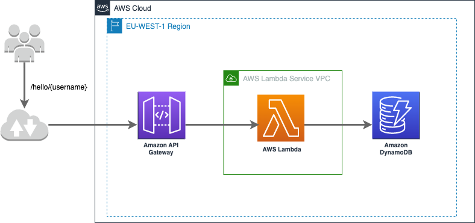

# Hello World API
> A simple api which uses api gateway to trigger lambdas in order to store and retrieve users date of birth in a database

Project containing code and infrastructure as code used to deploy aws resources for a simply api which stores a username and a date of birth in a database. Deploys lambda functions, api gateways and dynamodb table as a backend.



## Installing / Getting started

A quick introduction of the minimal setup you need to get a hello-world up & running.

```shell
# You will need to have aws credentials pointing to an active aws account. More info [HERE](https://docs.aws.amazon.com/sdk-for-java/v1/developer-guide/setup-credentials.html)
# Please modify the storage location of terraform state files, this config can be found under terraform/main.tf, provide s3 bucket and key

# To apply the resources just run the make command
make apply
```

Here you should say what actually happens when you execute the code above.

### Initial Configuration

Some projects require initial configuration (e.g. access tokens or keys, `npm i`).
This is the section where you would document those requirements.

### Testing

Currently only unit tests are provided for this project which cover the majority of its functionality

```shell
make test
```

### Building

Building the python code into zip files suitable for lambda deployment

```shell
make build
```

### Deploying / Publishing

Code is being deployed to lambda functions, no need to build beforehand as it happens as part of make command

```shell
# Its not necessary to build new lambda packages before attempting to apply terraform changes as the command make apply, builds the zip packages and then deploys them
make apply
# Build lambda packages plus deploys them
```

## Configuration

Available configuration for terraform resources can be found under terraform/variables.tf


Lambda function configuration, the following env vars are provided to lambdas through terraform so no need to change them

#### Region
Type: `String`  
Default: `'eu-west-1'`

Aws region where the resources should be deployed into

#### DATE_FORMAT
Type: `String`  
Default: `'%Y-%m-%d'`

Date format for expected dateOfBirths provided by client

#### DYNAMODB_TABLE_NAME
Type: `String`  
Default: `Users`

Dynamodb table name where the users info is stored
